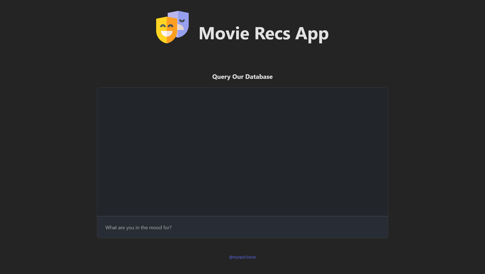

# Simple RAG - Movies Vector DB and Similarity Search



[**Live Demo:** movies-vector-db.vercel.app](https://movies-vector-db.vercel.app/)

A solo, final project for the Vector Embeddings and Semantic Search module of Scrimba's [AI Engineering Path](https://scrimba.com/the-ai-engineer-path-c02v). If you want to build this project from scratch, the learning notes in `/NOTES.md` should cover every feature you'll need, with links to the OpenAI/Supabase/Langchain docs so you can avoid relying on ChatGPT. 

[*Kanban Project Board:*](https://github.com/users/myopicOracle/projects/5) *Planning and task tracking for this project.*

## What This Project Is

This is my first attempt at working with vector embeddings and semantic search from the ground up. The app lets you chat about movies you're in the mood for, and it finds recommendations based on semantic similarity rather than just keywords.

I've wanted to understand how RAG works for a while now, and this project helped me see each piece of the puzzle - creating embeddings, storing them, and using them for semantic search. 

I definitely still have a lot to learn in order to build robust RAG pipelines, but seeing the parts of the sum make the sum of the parts much less intimidating. 

## Key Learning Resources

- [Scrimba AI Engineer Path](https://scrimba.com/the-ai-engineer-path-c02v)
- [OpenAI Embeddings Documentation](https://platform.openai.com/docs/guides/embeddings/what-are-embeddings)
- [Storing OpenAI embeddings in Postgres with pgvector](https://supabase.com/blog/openai-embeddings-postgres-vector)
- [Supabase Vector Querying Guide](https://supabase.com/docs/guides/ai/vector-columns)

## How It Works

The project has three main parts:

### Frontend (React)
- A simple chat interface where you can type what kind of movie you're looking for
- Built with React and Vite
- Calls the backend API and shows the conversation

### Backend (Cloudflare Worker)
- Takes your message and creates an embedding using OpenAI's text-embedding-3-small model
- Searches through a Supabase vector database using semantic similarity
- Uses the found movie context along with your question to generate a friendly response with `gpt-4.1-nano`

### Database (Supabase)
- Stores movie information as embeddings in a vector table using the pgvector extension
- Has a custom function `match_documents` that finds the most similar movies based on the embedding similarity

## What I Learned

This was my first time:
- Creating and storing text embeddings
- Setting up a vector database with pgvector
- Doing semantic similarity search
- Building a basic RAG system from scratch

The part that really clicked for me was seeing how the embedding vector acts like a coordinate in meaning-space - similar meanings end up close together. The implementation is pretty simple, but seeing it work was exciting.

## Technical Implementation

### Turning Text Data into Embedding Vectors

The app uses OpenAI's `text-embedding-3-small` model to create vector representations of both the movie descriptions and user queries:

```js
const embedding = await openai.embeddings.create({
    model: "text-embedding-3-small",
    input: userQuery,
    encoding_format: "float",
})
```

### Storing Embeddings as Vector Table

I set up Supabase with the pgvector extension and created a table to store the movie data. The vector dimension of 1536 matches the output size of OpenAI's text-embedding-3-small model:

```sql
create table documents (
  id serial primary key,
  title text not null,
  release_year text not null,
  content text not null,
  embedding extensions.vector(1536)
);
```

Then I edited the SQL function from [Supabase's docs](https://supabase.com/blog/openai-embeddings-postgres-vector) for similarity search:

```sql
create or replace function match_documents (
  query_embedding extensions.vector(1536),
  match_threshold float,
  match_count int
)
returns table (
  id bigint,
  title text,
  release_year text,
  content text,
  similarity float
)
language sql stable
as $$
  select
    documents.id,
    documents.title,
    documents.release_year,
    documents.content,
    1 - (documents.embedding <=> query_embedding) as similarity
  from documents
  where 1 - (documents.embedding <=> query_embedding) > match_threshold
  order by (documents.embedding <=> query_embedding) asc
  limit match_count;
$$;
```

### Calling Semantic Search on Vector Table

The search works by:
1. Creating an embedding of the user's query
2. Using the `match_documents` function to find similar movies
3. Passing the found context to `gpt-4.1-nano` for a conversational response

```js
const { data } = await supabase.rpc('match_documents', {
  query_embedding: embedding,
  match_threshold: 0.1,
  match_count: 1
})
```

### Conversational RAG with Similarity Matches

The matched result is passed in, and uses a system prompt delineate the movie context from the user query:

```js
const systemMessage = {
  role: 'system',
  content: 'You are a helpful assistant who enjoys recommending movies to users. You will be given two pieces of information - some context about the movie and a question. Your task is to formulate an answer to the question based on the provided context. Use a friendly and conversational tone.'
}
```

## Tech Stack

- **Frontend**: React, Vite
- **Backend**: Cloudflare Workers
- **Database**: Supabase with pgvector extension
- **AI**: OpenAI for embeddings and chat completion
- **Vector Operations**: Supabase's rpc function for similarity search

## Getting Started

1. Set up a Supabase project and enable the pgvector extension
2. Run the `documents.sql` file to create the table and search function
3. Create embeddings for your movie data and store them in Supabase (see `NOTES.md` for the embedding creation process)
4. Deploy the Cloudflare Worker with your API keys
5. Update the endpoint URL in the Chat component
6. Run the React app

---

*Last updated: November 27, 2025*